# Task Execution Service - Domain Model

## Overview

The Task Execution Service domain model implements a comprehensive task management system using Domain-Driven Design principles. The model centers around the WorkTask Aggregate, which represents all types of warehouse work activities.

## Class Diagram

```mermaid
classDiagram
    class WorkTask {
        +String taskId
        +TaskType type
        +TaskStatus status
        +TaskPriority priority
        +int priorityScore
        +String warehouseId
        +String zone
        +String assignedOperatorId
        +LocalDateTime createdAt
        +LocalDateTime requiredBy
        +LocalDateTime startedAt
        +LocalDateTime completedAt
        +TaskDetails details
        +Map~String Object~ metadata
        +createTask()
        +assignOperator(operatorId)
        +startTask()
        +completeTask()
        +cancelTask(reason)
        +updatePriority(score)
        +pauseTask()
        +resumeTask()
    }

    class TaskType {
        <<enumeration>>
        PICKING
        PUTAWAY
        REPLENISHMENT
        CYCLE_COUNT
        MOVE
    }

    class TaskStatus {
        <<enumeration>>
        PENDING
        ASSIGNED
        IN_PROGRESS
        PAUSED
        COMPLETED
        CANCELLED
        FAILED
    }

    class TaskPriority {
        <<enumeration>>
        CRITICAL
        HIGH
        MEDIUM
        LOW
        DEFERRED
    }

    class TaskDetails {
        <<abstract>>
        +String sourceLocation
        +String destinationLocation
        +List~TaskItem~ items
        +Map~String Object~ attributes
    }

    class PickTaskDetails {
        +String orderId
        +String waveId
        +String customerId
        +String carrier
        +LocalDateTime carrierCutoff
        +List~PickItem~ pickItems
        +PickingMethod method
    }

    class PutawayTaskDetails {
        +String receiptId
        +String containerId
        +PutawayStrategy strategy
        +List~PutawayItem~ items
    }

    class ReplenishmentTaskDetails {
        +String fromLocation
        +String toLocation
        +ReplenishmentTrigger trigger
        +int minQuantity
        +int maxQuantity
        +List~ReplenishItem~ items
    }

    class CycleCountTaskDetails {
        +CountType countType
        +String reason
        +List~CountLocation~ locations
        +int expectedQuantity
        +CountMethod method
    }

    class MoveTaskDetails {
        +String reason
        +MoveType moveType
        +String requesterId
        +List~MoveItem~ items
    }

    class TaskItem {
        <<abstract>>
        +String itemId
        +String sku
        +int quantity
        +String unitOfMeasure
    }

    class Operator {
        +String operatorId
        +String name
        +OperatorStatus status
        +Set~TaskType~ capabilities
        +String currentZone
        +String currentTaskId
        +LocalDateTime lastActivityTime
        +OperatorMetrics metrics
        +assignTask(taskId)
        +completeTask(taskId)
        +goOnline()
        +goOffline()
        +updateLocation(zone)
    }

    class OperatorStatus {
        <<enumeration>>
        AVAILABLE
        BUSY
        BREAK
        OFFLINE
    }

    class TaskPriorityCalculator {
        +Map~String Double~ weights
        +int calculatePriority(task)
        +int calculateSLAScore(task)
        +int calculateCutoffScore(task)
        +int calculateCustomerScore(task)
        +int calculateZoneScore(task)
        +int calculateAgeScore(task)
        +int calculateDynamicPriority(task, context)
        +PriorityAdjustment recommendAdjustment(task, metrics)
    }

    class TaskQueueManager {
        +void enqueue(task)
        +Optional~String~ dequeue(workerId, warehouseId, zone, capabilities)
        +void remove(task)
        +QueueStatus getQueueStatus(warehouseId, zone, type)
        +int getQueueDepth(warehouseId, zone, type)
        +Optional~String~ peek(warehouseId, zone, type)
        +void clearQueue(warehouseId, zone, type)
    }

    class QueueStatus {
        +String queueKey
        +String warehouseId
        +String zone
        +TaskType type
        +int queueDepth
        +String oldestTaskId
        +LocalDateTime oldestTaskTime
        +double averagePriority
    }

    class TaskMetrics {
        +int totalTasks
        +int completedTasks
        +int failedTasks
        +int cancelledTasks
        +double averageCompletionTime
        +double throughputPerHour
        +Map~TaskType Integer~ tasksByType
        +Map~String Integer~ tasksByZone
        +Map~TaskPriority Integer~ tasksByPriority
    }

    class TaskAllocationStrategy {
        <<interface>>
        +Optional~String~ selectOperator(task, availableOperators)
        +List~WorkTask~ prioritizeTasks(tasks)
        +boolean canAssign(task, operator)
    }

    class ZoneBasedAllocation {
        +Optional~String~ selectOperator(task, operators)
        +double calculateZoneAffinity(task, operator)
    }

    class SkillBasedAllocation {
        +Optional~String~ selectOperator(task, operators)
        +boolean hasRequiredSkills(task, operator)
    }

    class LoadBalancedAllocation {
        +Optional~String~ selectOperator(task, operators)
        +int getOperatorLoad(operatorId)
    }

    WorkTask "1" --> "1" TaskType : has
    WorkTask "1" --> "1" TaskStatus : has
    WorkTask "1" --> "1" TaskPriority : has
    WorkTask "1" --> "1" TaskDetails : contains
    TaskDetails <|-- PickTaskDetails : extends
    TaskDetails <|-- PutawayTaskDetails : extends
    TaskDetails <|-- ReplenishmentTaskDetails : extends
    TaskDetails <|-- CycleCountTaskDetails : extends
    TaskDetails <|-- MoveTaskDetails : extends
    TaskDetails "1" *-- "0..*" TaskItem : contains
    WorkTask "0..1" -- "0..1" Operator : assigned to
    Operator "1" --> "1" OperatorStatus : has
    TaskPriorityCalculator ..> WorkTask : calculates for
    TaskQueueManager "1" *-- "0..*" QueueStatus : manages
    TaskQueueManager ..> WorkTask : queues
    TaskAllocationStrategy <|-- ZoneBasedAllocation : implements
    TaskAllocationStrategy <|-- SkillBasedAllocation : implements
    TaskAllocationStrategy <|-- LoadBalancedAllocation : implements
    TaskAllocationStrategy ..> Operator : allocates to
```



## Entity Relationships


## Value Objects

### TaskItem
```java
public class TaskItem {
    private String itemId;
    private String sku;
    private String productName;
    private int quantity;
    private String unitOfMeasure;
    private double weight;
    private double volume;
    private Map<String, Object> attributes;
}
```

### Location
```java
public class Location {
    private String locationId;
    private String zone;
    private String aisle;
    private String bay;
    private String level;
    private LocationType type;
    private Coordinates coordinates;
}
```

### OperatorMetrics
```java
public class OperatorMetrics {
    private int tasksCompleted;
    private int tasksPerHour;
    private double accuracy;
    private double utilization;
    private long totalWorkTime;
    private Map<TaskType, Integer> tasksByType;
}
```

### PriorityContext
```java
public class PriorityContext {
    private boolean operatorInSameZone;
    private boolean partOfBatch;
    private boolean waveReleased;
    private int queueDepth;
    private SystemLoadMetrics systemLoad;
}
```

## Domain Events


## Aggregates and Boundaries

### WorkTask Aggregate
- **Root**: WorkTask
- **Entities**: TaskDetails (polymorphic)
- **Value Objects**: TaskItem, Location, PriorityContext
- **Invariants**:
  - A task can only be in one status at a time
  - Tasks must have valid transitions between statuses
  - Assigned tasks must have an operator
  - Completed tasks cannot be modified

### Operator Aggregate
- **Root**: Operator
- **Value Objects**: OperatorMetrics, Capabilities
- **Invariants**:
  - An operator can only work on one task at a time
  - Operator must be AVAILABLE to be assigned tasks
  - Capabilities determine assignable task types

## Domain Services

### TaskPriorityCalculator
Advanced priority calculation service:
- `calculatePriority()` - Multi-factor priority scoring
- `calculateSLAScore()` - SLA-based urgency
- `calculateCutoffScore()` - Carrier deadline scoring
- `calculateCustomerScore()` - Customer tier priority
- `calculateZoneScore()` - Zone efficiency scoring
- `calculateAgeScore()` - Task aging priority
- `calculateDynamicPriority()` - Context-aware priority
- `recommendAdjustment()` - Priority adjustment suggestions

### TaskQueueManager
Redis-based queue management:
- `enqueue()` - Add task to priority queue
- `dequeue()` - Get highest priority task
- `remove()` - Cancel queued task
- `getQueueStatus()` - Queue metrics and depth
- `peek()` - View next task without removal
- `clearQueue()` - Empty entire queue

### TaskAllocationService
Intelligent task assignment:
- `assignNextTask()` - Assign best task to operator
- `findBestOperator()` - Match task to operator
- `batchAssignment()` - Assign multiple tasks
- `rebalanceTasks()` - Redistribute workload

### TaskMonitoringService
Real-time task tracking:
- `getTaskProgress()` - Individual task status
- `getOperatorPerformance()` - Operator metrics
- `detectBottlenecks()` - Identify slow zones
- `predictCompletion()` - ETA calculation

## Repository Interfaces

```java
public interface TaskRepository {
    WorkTask findById(String taskId);
    List<WorkTask> findByStatus(TaskStatus status);
    List<WorkTask> findByOperator(String operatorId);
    List<WorkTask> findByWarehouseAndZone(String warehouseId, String zone);
    List<WorkTask> findPendingTasks();
    WorkTask save(WorkTask task);
    void delete(String taskId);
}

public interface OperatorRepository {
    Operator findById(String operatorId);
    List<Operator> findAvailable(String warehouseId);
    List<Operator> findByZone(String zone);
    List<Operator> findByCapability(TaskType type);
    Operator save(Operator operator);
}
```

## Business Rules

1. **Task Status Transitions**
   ```
   PENDING -> ASSIGNED -> IN_PROGRESS -> COMPLETED
                    \-> CANCELLED
                          \-> PAUSED -> IN_PROGRESS
   ```

2. **Priority Calculation Rules**
   - SLA urgency has highest weight (35%)
   - Carrier cutoffs second priority (30%)
   - Customer tier affects priority (20%)
   - Zone efficiency optimization (10%)
   - Age-based escalation (5%)

3. **Assignment Rules**
   - Operator must have required capabilities
   - Prefer operators in same zone
   - Balance workload across operators
   - Respect operator availability

4. **Queue Management**
   - Lower score = higher priority in queue
   - Tasks expire after configurable time
   - Failed tasks can be requeued
   - Batch dequeue for efficiency

## Performance Considerations

- Priority calculation cached for 5 minutes
- Queue operations use Redis sorted sets for O(log n) performance
- Batch processing for multiple task updates
- Asynchronous event publishing
- Connection pooling for Redis operations
- MongoDB indexes on status, operator, warehouse, zone fields

## Task Type Modifiers

Different task types have priority modifiers:
- **PUTAWAY**: 1.1x (free up receiving)
- **PICKING**: 1.0x (normal priority)
- **REPLENISHMENT**: 0.8x (lower priority)
- **MOVE**: 0.7x (lower priority)
- **CYCLE_COUNT**: 0.6x (lowest priority)