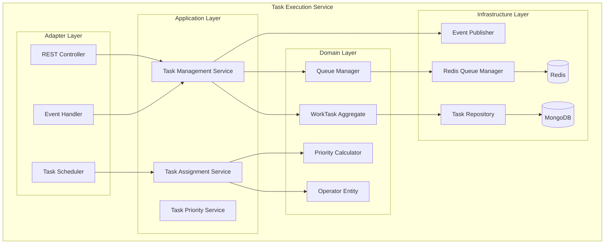

# Task Execution Service Documentation

## Overview

The Task Execution Service is the core work orchestration engine for the warehouse management system. It manages all warehouse tasks including picking, putaway, replenishment, cycle counting, and movement operations. The service implements sophisticated priority calculation algorithms and maintains task queues using Redis for high-performance task assignment.

## Table of Contents

1. [Architecture Overview](#architecture-overview)
2. [Domain Model](#domain-model)
3. [Task Priority System](#task-priority-system)
4. [Queue Management](#queue-management)
5. [API Documentation](#api-documentation)
6. [Integration Points](#integration-points)
7. [Configuration](#configuration)

## Architecture Overview



## Quick Start

```bash
# Run the service
mvn spring-boot:run

# Run tests
mvn test

# Build Docker image
mvn spring-boot:build-image
```

## Key Features

- **Multi-Factor Priority Calculation**: SLA, carrier cutoffs, customer tiers, zone efficiency, task age
- **Redis-Based Queue Management**: High-performance task queuing with sorted sets
- **Real-time Task Assignment**: Dynamic task allocation based on operator capabilities
- **Task Type Support**: Picking, putaway, replenishment, cycle count, movement
- **Priority Adjustment**: Dynamic priority recalculation based on system load
- **Event-Driven Updates**: Reacts to wave releases, order changes, inventory events

## Task Types

### Supported Task Types
- **PICKING**: Order fulfillment picking tasks
- **PUTAWAY**: Receiving and storage tasks
- **REPLENISHMENT**: Stock replenishment from bulk to pick locations
- **CYCLE_COUNT**: Inventory accuracy checks
- **MOVE**: General inventory movement tasks

## Priority Calculation

The service uses a sophisticated multi-factor priority calculation:

### Priority Factors
1. **SLA Urgency** (35% weight)
   - Past deadline: 100 points
   - <1 hour: 95 points
   - <2 hours: 90 points
   - <4 hours: 80 points
   - <8 hours: 70 points

2. **Carrier Cutoff** (30% weight)
   - Missed cutoff: 100 points
   - <30 minutes: 95 points
   - <1 hour: 90 points
   - <2 hours: 80 points

3. **Customer Tier** (20% weight)
   - Platinum: 100 points
   - Gold: 85 points
   - Silver: 70 points
   - Bronze: 55 points
   - Standard: 40 points

4. **Zone Efficiency** (10% weight)
   - Hot zone (A): 90 points
   - Warm zone (B): 70 points
   - Normal zone (C): 50 points
   - Low traffic: 30 points

5. **Task Age** (5% weight)
   - >24 hours: 100 points
   - >12 hours: 80 points
   - >6 hours: 60 points
   - >2 hours: 40 points

## Queue Management

Tasks are managed in Redis sorted sets with the following structure:
- Queue Key: `task:queue:{warehouseId}:{zone}:{taskType}`
- Score: Priority value (lower score = higher priority)
- Member: Task ID

### Queue Operations
- **Enqueue**: Add task with calculated priority
- **Dequeue**: Retrieve highest priority task
- **Peek**: View next task without removal
- **Remove**: Cancel specific task
- **Clear**: Empty entire queue

## Technology Stack

- Java 21
- Spring Boot 3.2
- MongoDB (persistence)
- Redis (queue management)
- Apache Kafka (events)
- Maven

## Performance Metrics

- Priority calculation: <1ms per task
- Queue operations: <5ms average
- Batch processing: 1000 tasks in ~500ms
- Redis queue capacity: 100,000+ tasks per queue

## Contact

- Service Owner: WES Team
- Slack: #wes-task-execution