# Task Execution Service - Sequence Diagrams

## 1. Task Creation and Priority Calculation Flow

### Create Pick Task from Wave Release

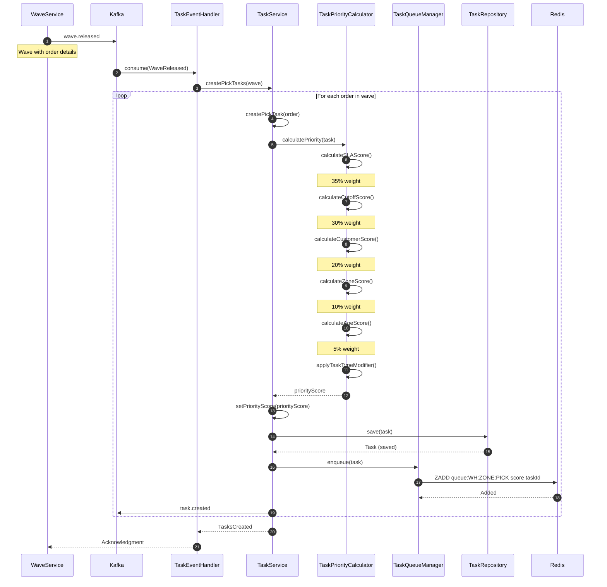

### Create Putaway Task from Receipt

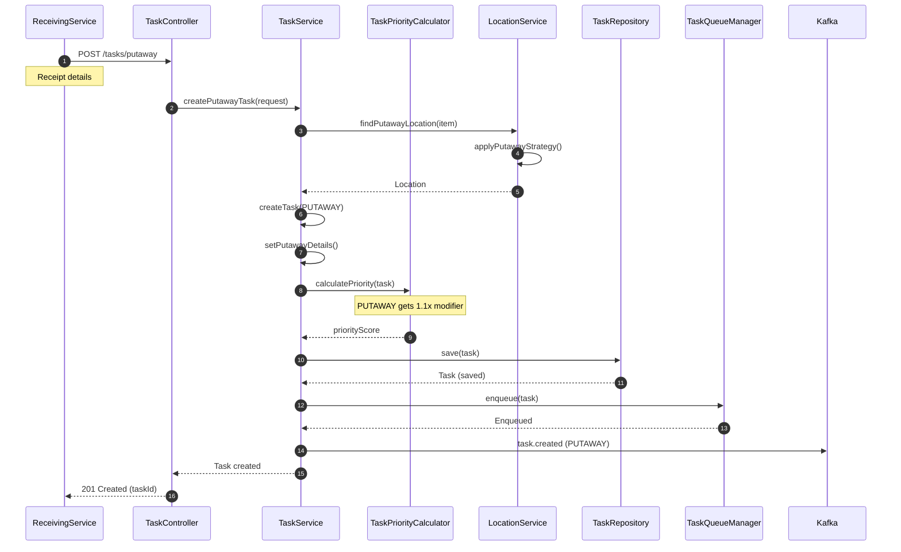

## 2. Task Assignment and Dequeue Flow

### Operator Requests Next Task

```mermaid
sequenceDiagram
    autonumber
    participant MobileApp
    participant TaskController
    participant TaskAssignmentService
    participant OperatorService
    participant TaskQueueManager
    participant TaskService
    participant TaskRepository
    participant Redis

    MobileApp->>TaskController: GET /tasks/next
    Note over MobileApp: Operator ID in header

    TaskController->>TaskAssignmentService: getNextTask(operatorId)

    TaskAssignmentService->>OperatorService: getOperator(operatorId)
    OperatorService-->>TaskAssignmentService: Operator

    TaskAssignmentService->>TaskAssignmentService: validateOperatorAvailable()

    TaskAssignmentService->>TaskQueueManager: dequeue(operatorId, warehouse, zone, capabilities)

    TaskQueueManager->>TaskQueueManager: getEligibleQueues()
    Note over TaskQueueManager: Based on capabilities

    loop For each eligible queue
        TaskQueueManager->>Redis: ZRANGE queue 0 0
        Redis-->>TaskQueueManager: taskId (if exists)

        alt Task found
            TaskQueueManager->>Redis: ZREM queue taskId
            Redis-->>TaskQueueManager: Removed
            break Task dequeued
        end
    end

    TaskQueueManager-->>TaskAssignmentService: taskId

    TaskAssignmentService->>TaskService: assignTask(taskId, operatorId)

    TaskService->>TaskRepository: findById(taskId)
    TaskRepository-->>TaskService: Task

    TaskService->>TaskService: updateStatus(ASSIGNED)
    TaskService->>TaskService: setOperator(operatorId)

    TaskService->>TaskRepository: save(task)
    TaskRepository-->>TaskService: Task (assigned)

    TaskService->>Kafka: task.assigned

    TaskService-->>TaskAssignmentService: AssignedTask

    TaskAssignmentService->>OperatorService: updateOperatorStatus(BUSY)

    TaskAssignmentService-->>TaskController: Task details
    TaskController-->>MobileApp: 200 OK (task)
```

### Batch Task Assignment

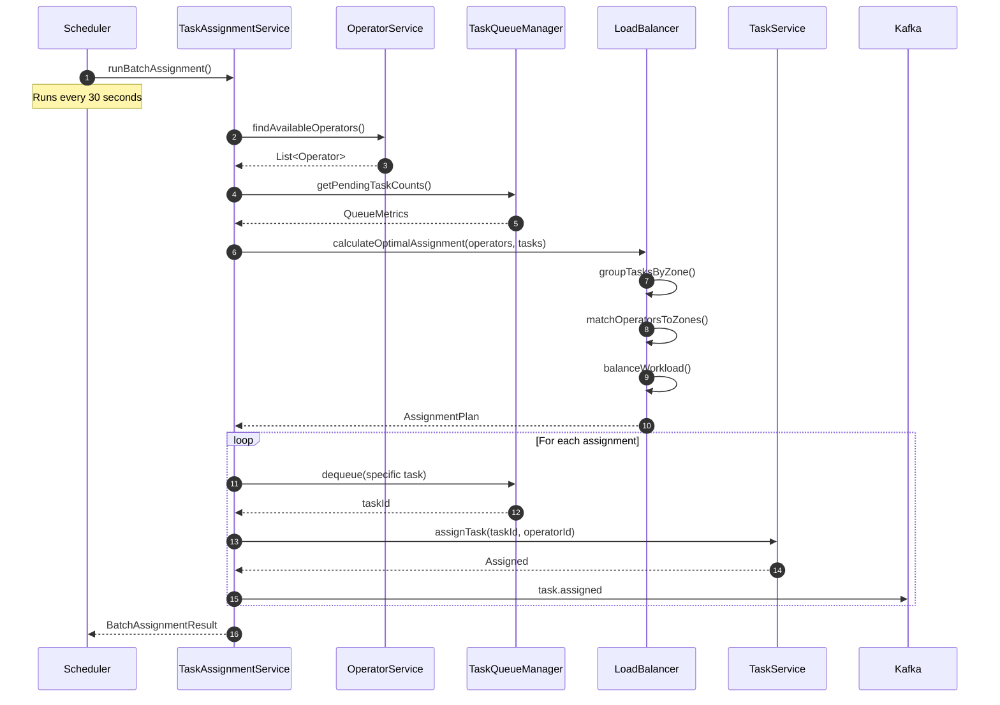

## 3. Task Execution Flow

### Start Task Execution

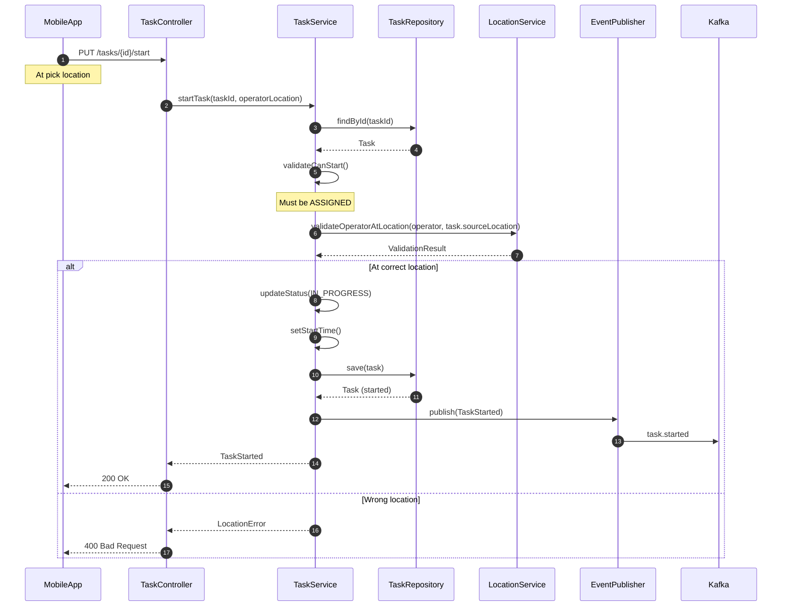

### Complete Task

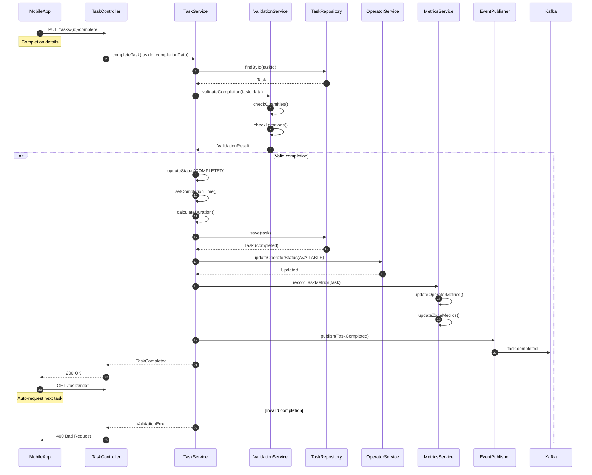

## 4. Priority Adjustment Flow

### Dynamic Priority Recalculation

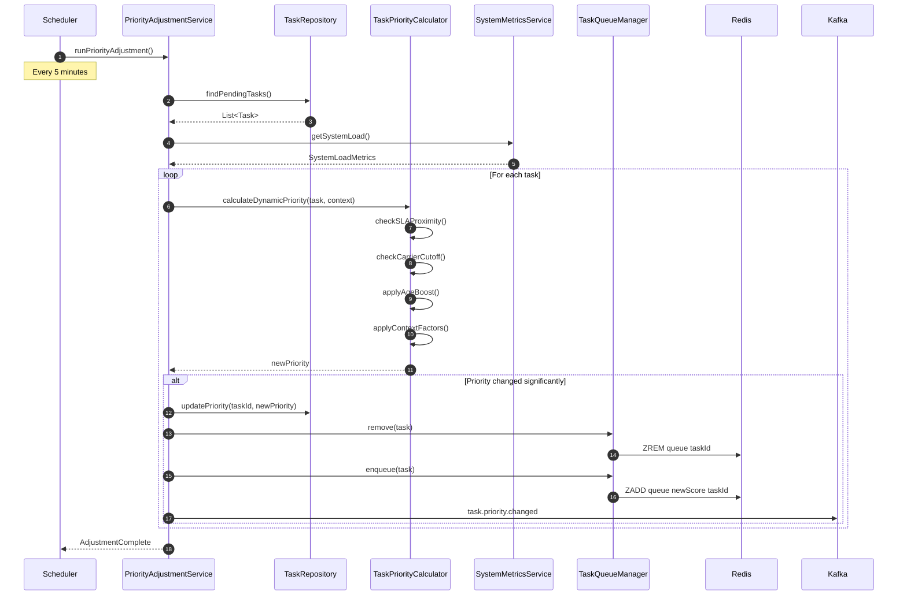

### Manual Priority Override

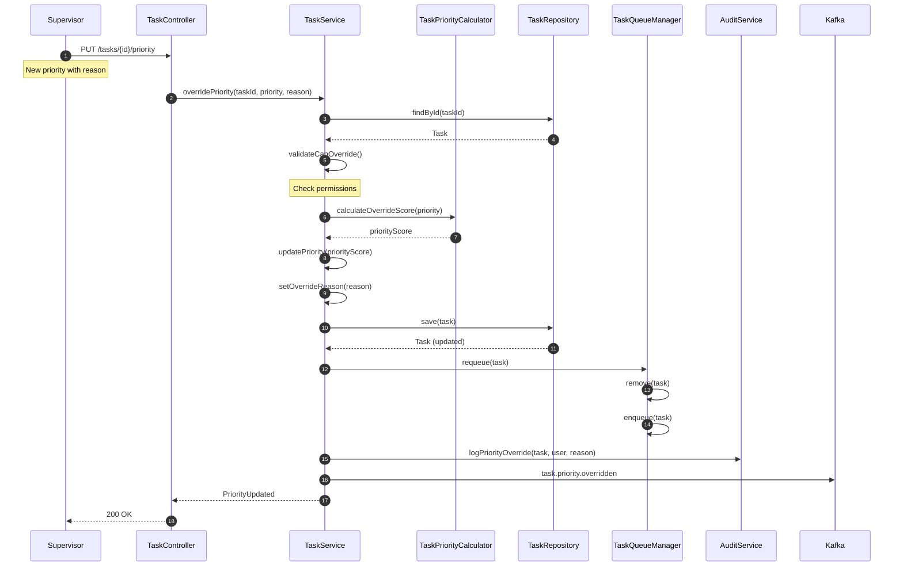

## 5. Task Exception Handling

### Task Failure and Recovery

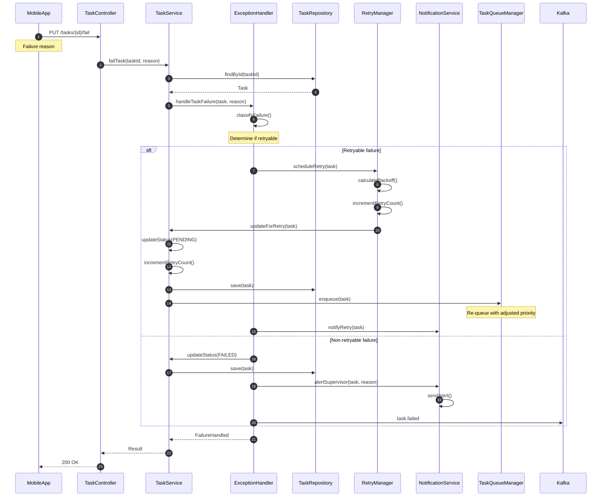

### Task Cancellation

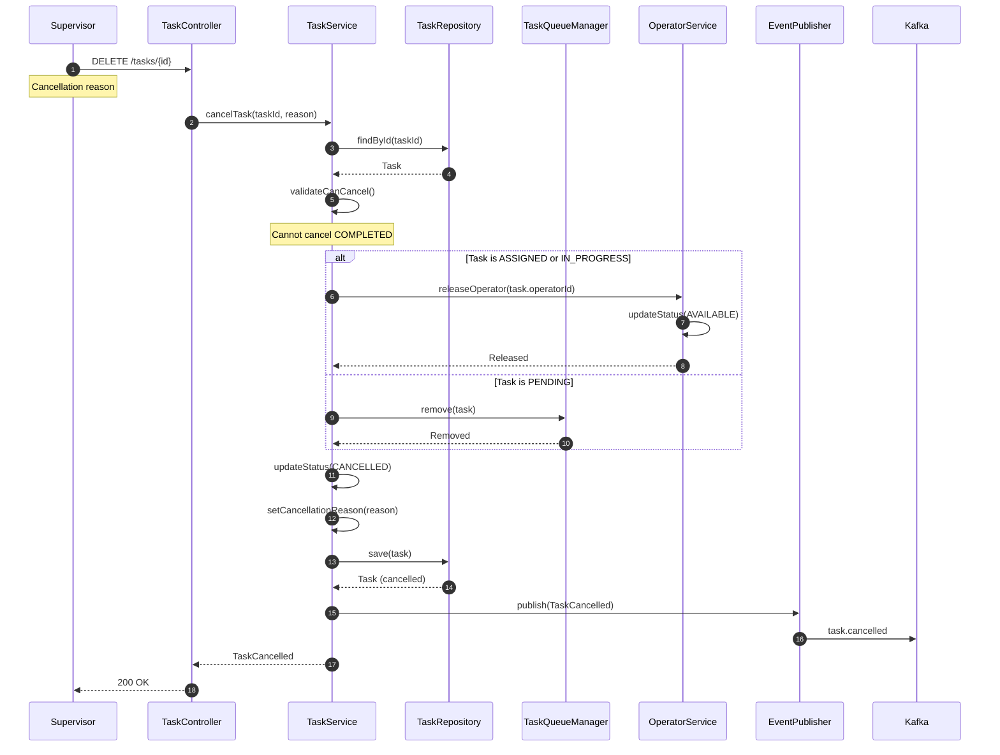

## 6. Queue Management Operations

### Queue Status Monitoring

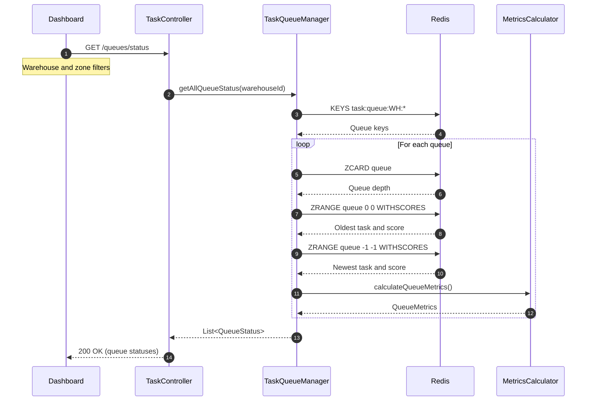

### Clear Stuck Queue

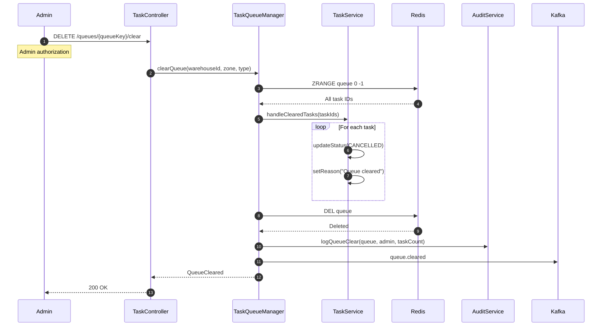

## 7. Performance Optimization Patterns

### Batch Priority Calculation

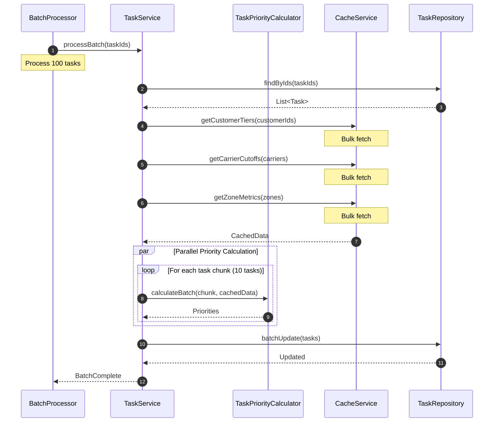

## Error Handling Patterns

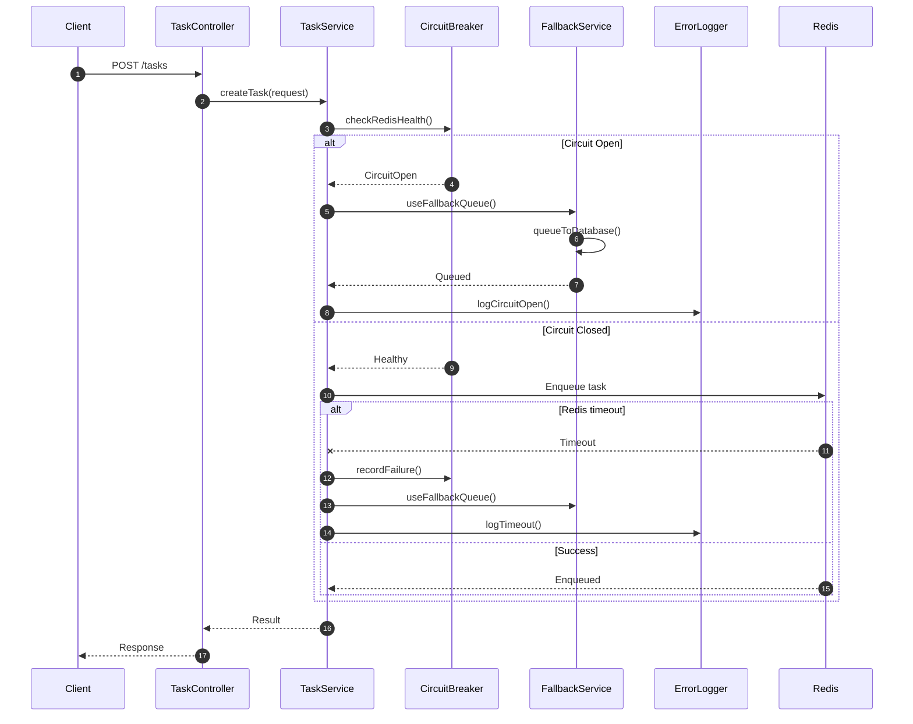

## Key Interaction Patterns

1. **Priority Queue Management**: Redis sorted sets for O(log n) operations
2. **Event-Driven Updates**: All state changes emit Kafka events
3. **Batch Processing**: Bulk operations for efficiency
4. **Circuit Breaker**: Fallback to database when Redis unavailable
5. **Retry with Backoff**: Exponential backoff for failed tasks
6. **Audit Logging**: All manual interventions are logged
7. **Performance Metrics**: Real-time tracking of queue depths and throughput