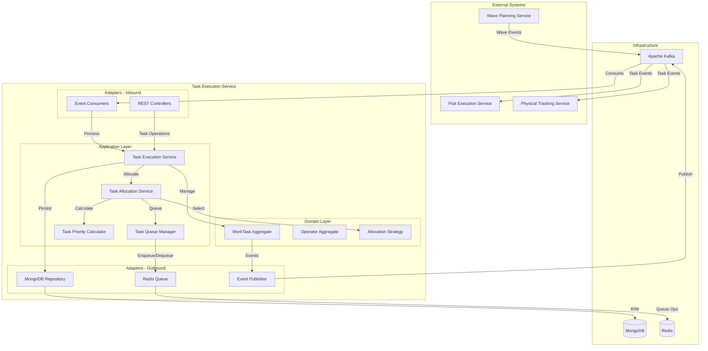

# Task Execution Service - Architecture

This document provides a comprehensive overview of the Task Execution Service architecture, following Hexagonal Architecture with Domain-Driven Design principles.

## High-Level System Architecture



## Application Services

### Task Execution Service
- `createTask(TaskRequest)` - Create new task
- `assignTask(String taskId, String operatorId)` - Assign to operator
- `startTask(String taskId)` - Start execution
- `completeTask(String taskId)` - Complete task
- `cancelTask(String taskId)` - Cancel task
- `pauseTask(String taskId)` - Pause task
- `resumeTask(String taskId)` - Resume task

### Task Allocation Service
- `assignNextTask(String operatorId)` - Get next task for operator
- `findBestOperator(WorkTask)` - Match task to operator
- `batchAssignment(List<WorkTask>)` - Assign multiple tasks
- `rebalanceTasks(String warehouseId)` - Redistribute workload

### Task Queue Manager (Redis-based)
- `enqueue(WorkTask)` - Add to priority queue (O(log n))
- `dequeue(operatorId, zone, capabilities)` - Get highest priority task
- `remove(String taskId)` - Remove from queue
- `getQueueStatus(warehouseId, zone)` - Queue metrics
- `peek(warehouseId, zone)` - View next task

### Task Priority Calculator
- `calculatePriority(WorkTask)` - Multi-factor scoring
- `calculateSLAScore(WorkTask)` - SLA urgency (35% weight)
- `calculateCutoffScore(WorkTask)` - Carrier deadline (30% weight)
- `calculateCustomerScore(WorkTask)` - Customer tier (20% weight)
- `calculateZoneScore(WorkTask)` - Zone efficiency (10% weight)
- `calculateAgeScore(WorkTask)` - Task aging (5% weight)

## Priority Calculation Algorithm

```java
public int calculatePriority(WorkTask task, PriorityContext context) {
    double slaScore = calculateSLAScore(task) * 0.35;
    double cutoffScore = calculateCutoffScore(task) * 0.30;
    double customerScore = calculateCustomerScore(task) * 0.20;
    double zoneScore = calculateZoneScore(task, context) * 0.10;
    double ageScore = calculateAgeScore(task) * 0.05;

    double totalScore = slaScore + cutoffScore + customerScore + zoneScore + ageScore;

    // Apply task type modifier
    totalScore *= getTaskTypeModifier(task.getType());

    return (int) (totalScore * 1000); // Lower score = higher priority
}
```

## Redis Queue Structure

### Priority Queue Implementation
Uses Redis Sorted Sets (ZADD, ZRANGE, ZREM):

```
Key: "task:queue:{warehouseId}:{zone}:{taskType}"
Score: Priority score (lower = higher priority)
Member: Task ID
```

### Queue Operations
- ZADD - O(log n) - Add task to queue
- ZRANGE - O(log n + m) - Get top m tasks
- ZREM - O(log n) - Remove task
- ZCARD - O(1) - Get queue size

## Database Design

### WorkTask Collection

```json
{
  "_id": "task-12345",
  "type": "PICKING",
  "status": "ASSIGNED",
  "priority": "HIGH",
  "priorityScore": 850,
  "warehouseId": "warehouse-1",
  "zone": "A1",
  "assignedOperatorId": "operator-123",
  "createdAt": "2025-10-19T10:00:00Z",
  "requiredBy": "2025-10-19T16:00:00Z",
  "details": {
    "orderId": "order-456",
    "waveId": "wave-789",
    "customerId": "customer-abc",
    "carrier": "FedEx",
    "carrierCutoff": "2025-10-19T18:00:00Z",
    "pickItems": [...]
  },
  "metadata": {
    "customerTier": "PREMIUM",
    "priority": "URGENT"
  }
}
```

### MongoDB Indexes

```javascript
db.tasks.createIndex({ "status": 1, "warehouseId": 1, "zone": 1 })
db.tasks.createIndex({ "assignedOperatorId": 1, "status": 1 })
db.tasks.createIndex({ "warehouseId": 1, "type": 1, "status": 1 })
db.tasks.createIndex({ "requiredBy": 1, "status": 1 })
```

## Event Schema

### TaskAssigned Event

```json
{
  "specversion": "1.0",
  "type": "com.paklog.task.assigned",
  "source": "task-execution-service",
  "id": "event-uuid",
  "time": "2025-10-19T10:00:00Z",
  "data": {
    "taskId": "task-12345",
    "type": "PICKING",
    "operatorId": "operator-123",
    "operatorName": "John Doe",
    "warehouseId": "warehouse-1",
    "zone": "A1",
    "assignedAt": "2025-10-19T10:00:00Z"
  }
}
```

## Configuration

```yaml
# Task Priority Configuration
task:
  priority:
    sla-weight: 0.35
    cutoff-weight: 0.30
    customer-weight: 0.20
    zone-weight: 0.10
    age-weight: 0.05
    cache-ttl: 5m
  queue:
    expiration: 24h
  type-modifiers:
    PUTAWAY: 1.1
    PICKING: 1.0
    REPLENISHMENT: 0.8
    MOVE: 0.7
    CYCLE_COUNT: 0.6

# Redis Configuration
spring:
  redis:
    host: localhost
    port: 6379
    pool:
      max-active: 20
      max-idle: 10
      min-idle: 5

# MongoDB Configuration
spring:
  data:
    mongodb:
      uri: mongodb://localhost:27017/task-execution
```

## Performance Optimizations

### Redis Queue Performance
- Sorted sets provide O(log n) operations
- Connection pooling for concurrent access
- Pipeline commands for batch operations
- Key expiration for abandoned tasks

### Priority Calculation Caching
- Calculated priorities cached for 5 minutes
- Cache invalidated on task updates
- Pre-calculated customer tier scores

### Database Optimization
- Compound indexes for common queries
- Projection queries for minimal data transfer
- Connection pooling
- Read preference for reporting

## Monitoring Metrics

- Task creation rate
- Task assignment latency
- Queue depth by zone
- Priority calculation duration
- Operator utilization %
- Task completion rate
- Average task duration
- Failed task percentage
